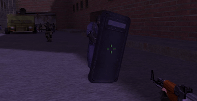

# Description

This is an [AmxModX](https://github.com/alliedmodders/amxmodx) plugin that makes shields breakable.

# Features

- Shields will break after a defined amount of damage
- Shields picked-up from ground will have the same HP as when dropped
- Detects damage based on weapon or by a cvar

# Configurations

By default, shields will receive weapon based damages. You can take control of the damage by uncommenting the directive `CVAR_BASED_DAMAGE` in source.

Cvars                   | Default | Description
------------------------|---------|-------------------
breakable_shield_hp     |     250 | Player's shield HP
breakable_shield_damage |      25 | Fixed mamage per hit. *Only if `CVAR_BASED_DAMAGE` directive is defined*

  
See default weapons damage for reference

  
  Default weapon damage can be seen on [here in ReGameDLL_CS](https://github.com/s1lentq/ReGameDLL_CS/blob/9b626b1d82f676287339240569934255613c4f0e/regamedll/dlls/weapons.h).
  
  Weapon           | Base damage
  -----------------|------------
  USP_DAMAGE       | 34
  MP5N_DAMAGE      | 26
  SG552_DAMAGE     | 33
  AK47_DAMAGE      | 36
  AUG_DAMAGE       | 32
  AWP_DAMAGE       | 115
  DEAGLE_DAMAGE    | 54
  G3SG1_DAMAGE     | 80
  GLOCK18_DAMAGE   | 25
  M249_DAMAGE      | 32
  M3_DAMAGE        | 20
  M4A1_DAMAGE      | 32
  MAC10_DAMAGE     | 29
  P228_DAMAGE      | 32
  P90_DAMAGE       | 21
  SCOUT_DAMAGE     | 75
  TMP_DAMAGE       | 20
  XM1014_DAMAGE    | 20
  ELITE_DAMAGE     | 36
  FIVESEVEN_DAMAGE | 20
  UMP45_DAMAGE     | 30
  SG550_DAMAGE     | 70
  GALIL_DAMAGE     | 30
  FAMAS_DAMAGE     | 30
  

# Requirements

- [AmxModX 1.8.3 or above](https://www.amxmodx.org/downloads-new.php?branch=1.9-dev&all=1)
- [Latest ReGameCS_DLL](https://github.com/s1lentq/ReGameDLL_CS)
- [Latest ReAPI](https://github.com/rehlds/reapi)

# Compiling

This project uses [custom entities data stock](https://forums.alliedmods.net/showthread.php?p=2829299), however, a copy of the library is distributed on this repository as for now (Oct 10, 2024) there is a [small typo on original realease](https://forums.alliedmods.net/showthread.php?p=2829299&postcount=3) that will generate runtime errors at map change. 

Make sure to include the `custom_entities_data.inc` and ReAPI's including files in your compiler's include directory.